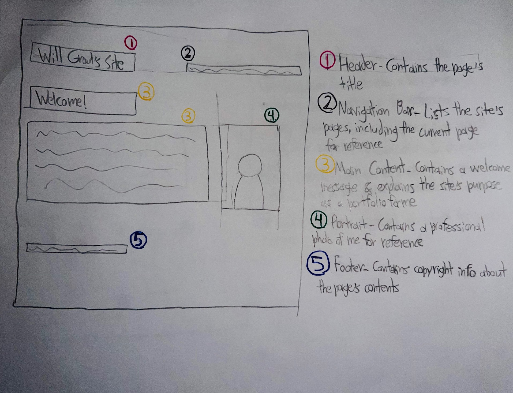
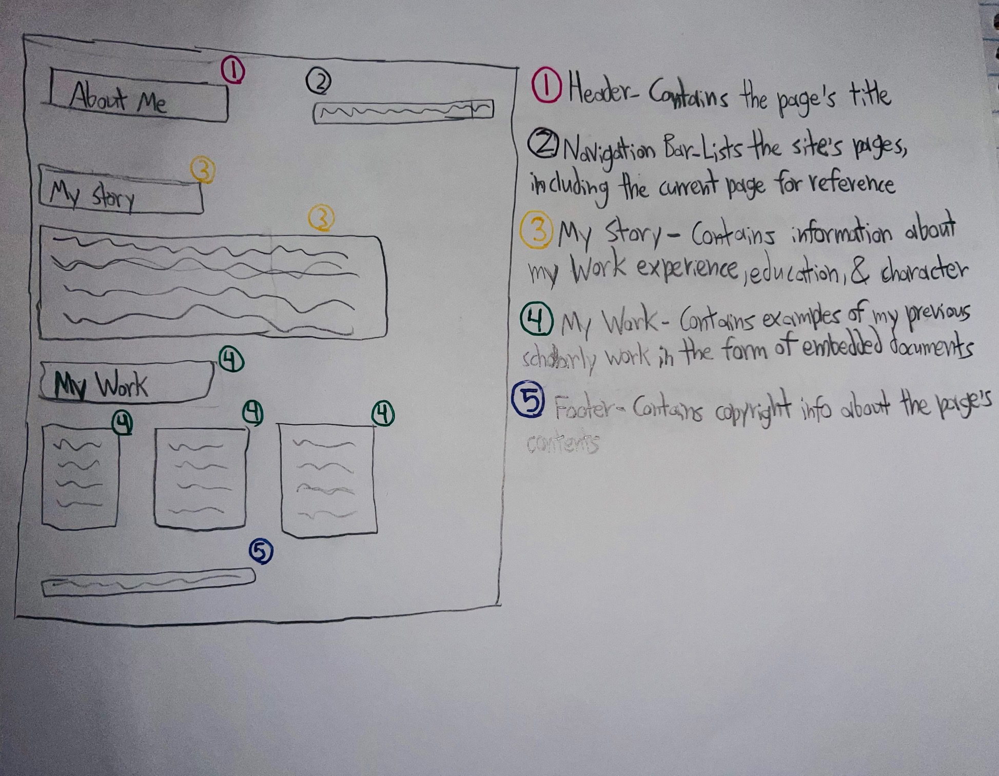
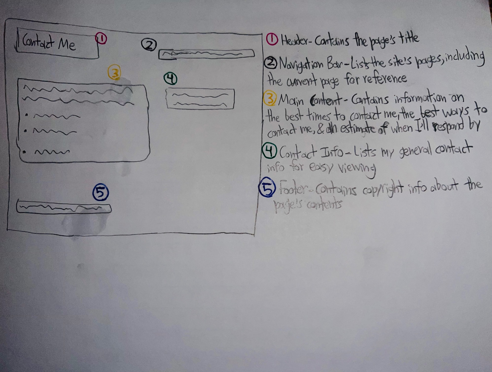

Author: Will Grout 
Institution: Wayne State University 
Class: INF 6420 - Intro to Web Development 
Professor: Axa Liauw 
This website is designed to serve as Will Grout's portfolio. The functions of the following pages are as follows:
-index.html serves as the site's home page and introduces users to the site's purpose
-aboutme.html includes details about the author's education and work experience
-contact.html details how to contact the author and provides users with a contact form
# Wireframes
## Index/Home Page

1. Header - Contains the page's title 

2. Navigation Bar - Lists the site's pages, including the current page for reference 

3. Main Content - Contains a weclome message and explains the site's purpose as a portfolio for me 

4. Portrait - Contains a professional photo of me for reference 

5. Footer - Contains copyright information about the page and its content 
## About Me Page

1. Header - Contains the page's title 

2. Navigation Bar - Lists the site's pages, including the current page for reference 

3. My Story - Contains information about my work experience, education, and character 

4. My Work - Contains examples of my previous scholarly work in the form of embedded documents 

5. Footer - Contains copyright information about the page and its content 
## Contact Me Page

1. Header - Contains the page's title 

2. Navigation Bar - Lists the site's pages, including the current page for reference 

3. Main Content - Contains information on the best times to contact me, the best ways to contact me, and a general estimate of how long it may take me to respond 

4. Contact Info - Lists my general contact info for easy viewing 

5. Footer - Contains copyright information about the page and its content 